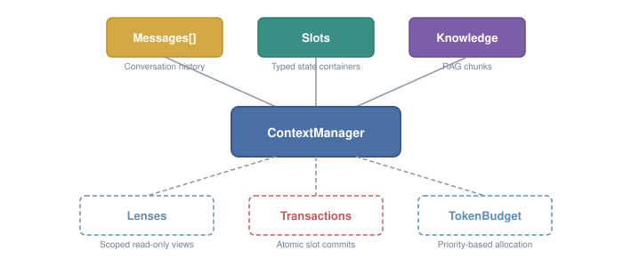
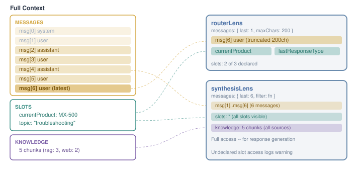
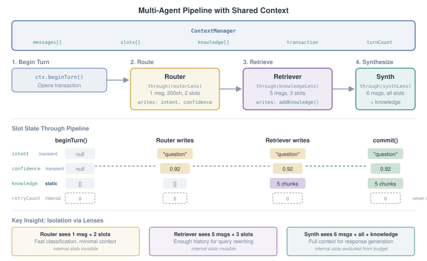

# Mosaic

Context management for LLM applications.

<p>
  
  
  
  
</p>

Your context is a mosaic of pieces — messages, state, knowledge, metadata. Mosaic helps you manage them.

## Why

Every LLM app treats context as a dumb message array. Mosaic treats it as managed state — with typed slots, scoped views, atomic transactions, and smart token allocation.

| Problem | Without Mosaic | With Mosaic |
|---------|---------------|-------------|
| "Who changed this state?" | Grep every mutation | Typed slots with ownership |
| "Why did the model miss that?" | Naive message count cap | Priority-based token budget |
| "What does this agent see?" | Manual context building | Lenses — declared, bounded views |
| "State is corrupted after error" | Half-updated fields | Transactions with rollback |

<p align="center"> 
</p>

## Install

```bash
npm install detailles/mosaic   # or: bun add detailles/mosaic
```

## Quick Start

```typescript
import { ContextManager } from 'mosaic';

const ctx = new ContextManager();

// Messages
ctx.addMessage('user', 'How do I reset my device?');
ctx.lastByRole('user');        // → { role: 'user', content: 'How do I reset my device?', ... }
ctx.depth();                    // → 1

// Typed slots
interface Product {
  id: string;
  name: string;
  category: string;
}

const currentProduct = ctx.defineSlot<Product | null>('currentProduct');

ctx.get(currentProduct);  // → undefined (unset)
ctx.set(currentProduct, { id: 'mx-500', name: 'MX-500', category: 'controller' });
ctx.get(currentProduct);  // → { id: 'mx-500', name: 'MX-500', category: 'controller' }
```

> **No default values.** Slots are strict: unset slots return `undefined`
> from `get()` and `peek()`. Silent defaults make it impossible to
> distinguish "never set" from "set to default" — if you want a seed value,
> write it explicitly with `ctx.set()` at startup.

## Writing to slots: the two paths

Mosaic exposes two write APIs. Use whichever is more convenient — they are behaviorally equivalent when a transaction is open.

| Call                               | When to use                              | Rollback-safe | Notes                                                                                          |
|------------------------------------|------------------------------------------|---------------|------------------------------------------------------------------------------------------------|
| `ctx.set(slot, value)`             | Normal path — write a slot.              | Yes (forwarded) | When a transaction is open, silently forwards to `transaction.set()` so rollback works.       |
| `ctx.transaction!.set(slot, value)`| When you already have the txn handle.   | Yes           | Direct stage into the current transaction's buffer.                                            |
| `ctx.as(id).set(slot, value)`      | Enforcing ownership.                     | Yes (forwarded) | Scoped handle; throws if `id` isn't in the slot's `owner` list. Otherwise identical to `set`. |

**Reads always see your writes within the same turn** — whether you wrote via `ctx.set()` or `transaction.set()`, a later `ctx.get()` in the same turn returns the new value. Reads outside a transaction, or via `ctx.peek()`, go directly against committed state.

## Features

### Typed Slots

Named, typed state containers with lifecycle and ownership control.

<p align="center"> 
</p>

```typescript
// Define a slot with a proper interface
interface PendingClarification {
  originalQuery: string;
  reason: 'missing_product' | 'ambiguous_query';
}

// Consume-once: auto-clears after first read
const pending = ctx.defineSlot<PendingClarification | undefined>('pendingClarification', {
  lifecycle: 'consume-once',
});

ctx.set(pending, { originalQuery: 'fix the error', reason: 'missing_product' });
ctx.get(pending);  // → { originalQuery: 'fix the error', reason: 'missing_product' }
ctx.get(pending);  // → undefined (consumed)

// Turn-scoped: auto-clears on nextTurn()
interface TurnMetrics {
  retrievalTimeMs: number;
  chunksUsed: number;
}

const turnMetrics = ctx.defineSlot<TurnMetrics | undefined>('turnMetrics', {
  lifecycle: 'turn-scoped',
});

ctx.set(turnMetrics, { retrievalTimeMs: 230, chunksUsed: 5 });
ctx.nextTurn();
ctx.get(turnMetrics);  // → undefined (cleared)

// Ownership: restrict who can write
const currentProduct = ctx.defineSlot<Product | null>('currentProduct', {
  owner: 'resolver',
});

ctx.as('resolver').set(currentProduct, myProduct);    // works
ctx.as('synthesizer').set(currentProduct, myProduct); // throws

// Persistence: controls token budget behavior
const product = ctx.defineSlot<Product | null>('product', {
  persistence: 'static',     // always in prompt, high priority
});
const confidence = ctx.defineSlot<number | undefined>('confidence', {
  persistence: 'transient',  // droppable under budget pressure
});
const retryCount = ctx.defineSlot<number>('retryCount', {
  persistence: 'internal',   // never rendered to LLM, system-only
});

// Budget-aware grouping
const { static: essential, transient: optional, internal } = ctx.slotsByPersistence();
// essential → always in prompt
// optional  → include if budget allows
// internal  → excluded from prompt entirely
```

**Persistence types:**

| Type | In prompt? | Budget priority | Use for |
|------|-----------|-----------------|---------|
| `static` | Always | High, not droppable | Product, topic, situational context |
| `transient` | When space allows | Low, droppable | Confidence scores, key terms |
| `internal` | Never | Excluded | Retry counts, response type, routing state |

### Lenses

Scoped, read-only views that declare what each consumer needs.

<p align="center"> 
</p>

```typescript
import { defineLens } from 'mosaic';

const routerLens = defineLens('router', {
  messages: { last: 1, maxChars: 200 },
  slots: ['currentProduct', 'lastResponseType'],
});

const view = ctx.through(routerLens);
view.messages;                  // 1 message, truncated to 200 chars
view.slots.currentProduct;      // { id: 'mx-500', ... }
view.slots.turnMetrics;         // logs warning, returns value (soft enforcement)
```

Lenses support a generic `filter` function for application-specific message filtering:

```typescript
const lens = defineLens('synthesis', {
  messages: {
    last: 6,
    filter: (msg) => !msg.content.startsWith('I cannot help with that'),
  },
  slots: '*',
});
```

### Transactions

Atomic slot commits with rollback on error.

<p align="center"> 
</p>

```typescript
const turn = ctx.beginTurn();

turn.set(currentProduct, myProduct);
turn.set(topic, 'troubleshooting');

// Read-your-writes: both handles see staged values within the turn
turn.get(currentProduct);  // → { id: 'mx-500', ... }
ctx.get(currentProduct);   // → { id: 'mx-500', ... } (staged; visible until commit/rollback)
ctx.peek(currentProduct);  // → previous committed value (bypasses the transaction)

try {
  const response = await llm.generate(prompt);
  turn.commit();      // all changes applied atomically
} catch {
  turn.rollback();    // all changes discarded, context unchanged
}
```

### Token Budget

Priority-based allocation that replaces naive message count caps.

<p align="center"> 
</p>

```typescript
import { TokenBudget, estimateTokens } from 'mosaic';

const budget = new TokenBudget({ limit: 8192, countTokens: estimateTokens });

budget.reserve('system', systemPrompt, { priority: 'fixed' });
budget.reserveItems('history', messages, { priority: 'high', strategy: 'tail' });
budget.reserveItems('knowledge', chunks, { priority: 'medium', strategy: 'rank' });
budget.reserve('state', stateContext, { priority: 'low', droppable: true });

const result = budget.compile();
result.sections;    // what fits
result.dropped;     // what was cut
result.usage;       // { used, limit, utilization }
```

Strategies: `tail` (keep recent), `rank` (keep highest-scored, **stable** on score ties), `truncate` (hard cut).

> **Stable rank.** `shrinkRank` is a stable sort: items with equal scores
> preserve their insertion order. This lets callers compose deterministic
> ranking by applying small numeric boosts in a pre-pass — e.g., add
> `+0.1` to chunks matching the current query intent, feed them to the
> budget, and the intent-relevant items win near-ties without overpowering
> clearly-better chunks.

### Filtering Knowledge with Predicates

`getKnowledge` and `KnowledgeLensConfig` accept an optional `where` predicate for application-specific filtering. Mosaic stays framework-agnostic — it doesn't know what "parameter" or "troubleshooting" means — but it gives you the hook to inject that logic via closures.

```typescript
// Direct filter on getKnowledge
const parameterChunks = ctx.getKnowledge({
  sources: ['rag'],
  where: (chunk) => (chunk.meta?.tags as { chunkType?: string })?.chunkType === 'parameter',
  top: 5,
});

// Filter ordering: sources → minScore → where → sort → top
// (predicate runs before sort/top so `top` always reflects the filtered set)

// Declarative filter on a lens
const parameterLens = defineLens('parameter-focus', {
  knowledge: {
    sources: ['rag'],
    where: (chunk) => (chunk.meta?.tags as { chunkType?: string })?.chunkType === 'parameter',
  },
});

const view = ctx.through(parameterLens);
view.knowledge;   // only parameter-tagged chunks
```

The `where` closure reads from `chunk.meta` — an opaque `Record<string, unknown>` that Mosaic never inspects. Your application layer decides what tags to attach when calling `addKnowledge`, and what predicates to apply at read time.

> **View cache + closures.** `ctx.through(lens)` memoizes lens views by lens
> name until the context mutates (`addKnowledge`, `addMessage`, slot write,
> `nextTurn`). A lens with a `where` closure that captures mutable state must
> be rebuilt per turn so the cache sees a fresh lens object.

### Message Queries

Replace scattered message-walking patterns.

```typescript
ctx.lastByRole('assistant');           // last message by role
ctx.recent(5);                         // last 5 messages
ctx.recentPairs(3);                    // last 3 user/assistant pairs
ctx.depth();                           // count of user messages
ctx.search('error', { role: 'user' }); // keyword search
ctx.getByTag('type', 'clarification'); // find by tag
```

### Renderers

Convert lens views to prompt strings.

```typescript
import { renderConversationSummary, renderRouterContext } from 'mosaic';

const summary = renderConversationSummary(ctx.through(synthesisLens));
const routerCtx = renderRouterContext(ctx.through(routerLens));
```

### Inspection

Debug the full context state at any point.

```typescript
const info = ctx.inspect();
// {
//   messageCount: 4,
//   depth: 2,
//   turnCount: 1,
//   slots: {
//     currentProduct: { value: { id: 'mx-500', ... }, lifecycle: 'persistent', writeCount: 1 },
//     topic: { value: 'troubleshooting', lifecycle: 'persistent', writeCount: 2 },
//   },
//   slotCount: 3,
//   activeSlotCount: 2,
// }
```

### Serialization

Snapshot and restore context state with custom serializers.

```typescript
// Save
const snapshot = ctx.snapshot();

// Restore
const ctx2 = new ContextManager();
ctx2.defineSlot<Product | null>('currentProduct');
ctx2.restore(snapshot);
```

Custom serializers for complex types (Map, Set, etc.):

```typescript
interface TrackedEntity {
  value: string;
  type: string;
  mentionCount: number;
}

const entities = ctx.defineSlot<Map<string, TrackedEntity>>('entities', {
  serialize: (m) => Array.from(m.entries()),
  deserialize: (raw) => new Map(raw as [string, TrackedEntity][]),
});
```

## Advanced Usage: Multi-Agent Pipeline

A complete example showing how multiple agents share one `ContextManager`, each reading through its own lens and writing through a shared transaction.

<p align="center"> 
</p>

```typescript
import { ContextManager, defineLens, TokenBudget, estimateTokens } from 'mosaic';

// ── 1. Setup: shared context + slots ───────────────────────────────

const ctx = new ContextManager({ logger: console });

// Slots — each agent reads/writes what it needs
const intent = ctx.defineSlot<string | null>('intent', {
  persistence: 'transient',
});
const confidence = ctx.defineSlot<number | null>('confidence', {
  persistence: 'transient',
});
const currentProduct = ctx.defineSlot<string | null>('currentProduct', {
  persistence: 'static',    // always in prompt
  owner: 'router',          // only the router can write this
});
const retryCount = ctx.defineSlot<number>('retryCount', {
  persistence: 'internal',  // never in prompt — system bookkeeping only
});
ctx.set(retryCount, 0);     // seed explicitly — slots have no default values

// ── 2. Lenses: each agent sees a different slice ───────────────────

const routerLens = defineLens('router', {
  messages: { last: 1, maxChars: 200 },
  slots: ['currentProduct', 'intent'],
});

const knowledgeLens = defineLens('knowledge', {
  messages: { last: 5 },
  slots: ['currentProduct', 'intent', 'confidence'],
  knowledge: { top: 10, minScore: 0.5 },
});

const synthesisLens = defineLens('synthesis', {
  messages: { last: 6, filter: (msg) => !msg.content.startsWith('I cannot') },
  slots: '*',
  knowledge: { top: 5 },
});

// ── 3. Pipeline: one turn through 4 stages ─────────────────────────

async function handleTurn(userMessage: string) {
  ctx.addMessage('user', userMessage);
  const txn = ctx.beginTurn();

  // Stage 1: Router — classify intent from minimal context
  const routerView = ctx.through(routerLens);
  const classification = await classifyIntent(routerView);
  txn.set(intent, classification.intent);
  txn.set(confidence, classification.confidence);
  ctx.as('router').set(currentProduct, classification.product);

  // Stage 2: Retriever — fetch knowledge using enriched context
  const knowledgeView = ctx.through(knowledgeLens);
  const chunks = await retrieveKnowledge(knowledgeView);
  ctx.addKnowledge('rag', chunks);

  // Stage 3: Synthesizer — generate response with full context + knowledge
  const synthView = ctx.through(synthesisLens);
  // internal slots (retryCount) are excluded — never sent to the LLM
  const { static: essential, transient: metadata } = ctx.slotsByPersistence();

  const budget = new TokenBudget({ limit: 8192, countTokens: estimateTokens });
  budget.reserve('system', SYSTEM_PROMPT, { priority: 'fixed' });
  budget.reserve('state', JSON.stringify(essential), { priority: 'high' });
  budget.reserveItems('history', synthView.messages.map(m => ({
    content: `${m.role}: ${m.content}`,
  })), { priority: 'high', strategy: 'tail' });
  budget.reserveItems('knowledge', synthView.knowledge.map(k => ({
    content: k.content, score: k.score,
  })), { priority: 'medium', strategy: 'rank' });

  const compiled = budget.compile();
  const response = await generateResponse(compiled);

  // Stage 4: Commit — all slot changes applied atomically
  ctx.addMessage('assistant', response, {
    tags: { responseType: 'answer', confidence: String(classification.confidence) },
  });

  try {
    txn.commit();   // intent, confidence, product — all applied at once
  } catch {
    txn.rollback(); // error? everything reverted, context unchanged
  }

  ctx.nextTurn();   // clears turn-scoped slots + knowledge for next turn
  return response;
}
```

Each agent only sees what it declared in its lens. The router gets 1 message and 2 slots (fast). The retriever gets 5 messages and 3 slots (enough for query rewriting). The synthesizer gets everything including knowledge chunks (full context for generation). All mutations are staged in a transaction and committed atomically at the end. Internal slots like `retryCount` are system bookkeeping — they participate in transactions but are never rendered to the LLM or included in the token budget.

## Logger

Mosaic accepts a logger via the `ILogger` interface. Default is no-op (silent).

```typescript
import type { ILogger } from 'mosaic';

const ctx = new ContextManager({
  logger: console,          // or winston, pino, or any { warn() }
});
```

## ESM / CJS

Mosaic ships dual ESM and CommonJS builds:

```typescript
import { ContextManager } from 'mosaic';         // ESM
const { ContextManager } = require('mosaic');     // CJS
```

## License

MIT
